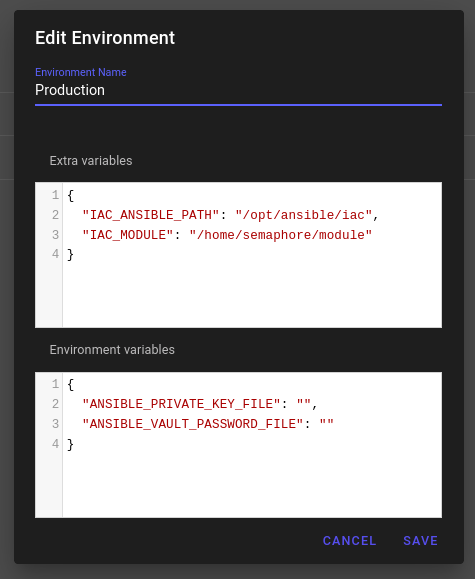
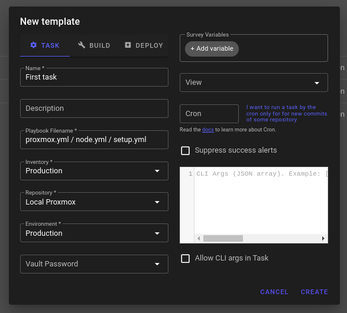

<h1 align="center">
  Homelab Proxmox v1.0
</h1>


<p align="center">
  
</p>

<h4 align="center">
  Management of users, rules, storage and node on proxmox server
</h4>

<p align="center">

  <a href="https://github.com/marcelobojikian" target="_blank">
    
  </a>
  <a href="https://github.com/marcelobojikian" target="_blank" >
    
  </a>
  <a href="https://www.linkedin.com/in/marcelobojikian/" target="_blank" >
    
  </a>

</p>

<p align="center">
  <a href="#-requirements">Requirements</a>&nbsp;&nbsp;&nbsp;|&nbsp;&nbsp;&nbsp;
  <a href="#-how-to-configure">How to configure</a>&nbsp;&nbsp;&nbsp;|&nbsp;&nbsp;&nbsp;
  <a href="#-how-to-use">How to use</a>&nbsp;&nbsp;&nbsp;|&nbsp;&nbsp;&nbsp;
  <a href="#-tips">Tips</a>&nbsp;&nbsp;&nbsp;|&nbsp;&nbsp;&nbsp;
  <a href="#memo-licença">Licença</a>
</p>

<br>

## 🔖 Requirements

For this project folder, make sure the packages are installed.

 - python3
 - docker
 - docker-compose
 - ssh-keygen

## 🔧 How to configure

Create a folder called **module** with the structure below:

> Todos os arquivos nessas pastas devem ter dois espacos ou um [tab](https://en.wikipedia.org/wiki/Tab_key), eles serao gerados automaticamente.
> veja em [How to use](#-how-to-use).

```bash
module
├── resources
│   ├── machines
│   ├── os_images
│   └── proxmox
│       ├── roles
│       │   └── ansible.yml
│       ├── storages
│       │   └── ansible.yml
│       ├── sudo_users
│       │   └── ansible.yml
│       └── users
│           └── ansible.yml
└── security
    ├── private-keys
    │   └── ansible-key
    ├── public-keys
    │   └── ansible-key.pub
    └── tokens
        └── ansible.token
```

| Folder | Description |
| :------ | :----------- |
| resources/machines | Virtual machines created in proxmox |
| resources/os_images | Images to be downloaded |
| resources/proxmox/roles | Roles to be created in proxmox |
| resources/proxmox/storages | Storages to be created in proxmox |
| resources/proxmox/sudo_users | Users who can use the sudo command on each machine created |
| resources/proxmox/users | Users to be created in proxmox |
| security/private-keys | SSH keys private |
| security/public-keys | SSH keys public |
| security/tokens | Folder where the tokens will be stored when the user is registered in proxmox |

### 👾 Ansible Proxmox User

The system depends on a token to manage VMs and LXC Containers,which will be generated after user creation.
This could be the default.

```yaml
  - name: ansibleRole
    privs: "Administrator"
```
__module/proxmox/roles/ansible.yml__

```yaml
  - name: ansible
    type: dir
    path: /var/lib/vz/ansible
    content: "images,rootdir,vztmpl,backup,iso,snippets"
```
__module/proxmox/storages/ansible.yml__

```yaml
  - name: ansible
    key_file: ansible-key.pub
```
__module/proxmox/sudo_users/ansible.yml__

```yaml
  - api_user: ansible@pam
    api_role: ansibleRole
    api_token_id: ansible-token
    on_file: ansible.token
```
__module/proxmox/users/ansible.yml__

### 🔑 Ansible ssh-key

To generate the SSH keys, use the command below. Don't forget to put the key __public ansible-key.pub__ in the correct folder __security/public-keys__

> The key has no password, it is recommended to enter the password after the -N option

```bash
ssh-keygen -q -t ed25519 -f "security/private-keys/ansible-key" -N ""
```

### 🙈 Ansible and Proxmox's Secrets

Set up the data previously provided in the group variables.

| Variable | Description |
| ------: | :----------- |
| ansible_user | refers to the *name* informed in __module/proxmox/sudo_users/ansible.yml__ |
| ansible_ip | refers to the IP that can access the VMs and LXC, it usually refers your ip ( $ *hostname -I* ). |
| ansible_key_file | name of the public key located in the variable *key_file* defined in __public_key_path__ in the __inventory__ of __semaphore__ |

Example:

```yaml
ansible_user: ansible
ansible_ip: '192.168.1.200'
ansible_key_file: ansible-key.pub
```
__proxmox/group_vars/all/vault.yml__

| Variable | Description |
| ------: | :----------- |
| api_user | refers to the *api_user* informed in __module/proxmox/users/ansible.yml__ |
| api_token_id | refers to the *api_token_id* informed in __module/proxmox/users/ansible.yml__ |
| api_token_secret | refers to the *on_file* informed in __module/proxmox/users/ansible.yml__ |

Example:

```yaml
api_user: ansible@pam
api_token_id: ansible-token
api_token_secret: ansible.token
```
__proxmox/group_vars/node/vault.yml__

| Variable | Description |
| ------: | :----------- |
| ansible_ssh_user | Root user entered when proxmox was installed |
| ansible_ssh_pass | Root password entered when proxmox was installed |

Example:

```yaml
ansible_ssh_user: root
ansible_ssh_pass: root
```
__proxmox/group_vars/proxmox/vault.yml__

## 🤔 How to use

> We used the [Semaphore](https://semui.co/) project to make it easier to run ansible.
>
> After running docker-compose, go to [localhost:3000](http://localhost:3000).
>
> For more details, see [Semaphore Docs](https://docs.semui.co/)

1. In the terminal,
    ```bash
    docker-compose up -d
    ```

2. Set the project repository

    

3. Set the environment variables

    
  
    By default, the data in the __module__ folder goes to */home/semaphore* and can be:
    ```json
    {
      "resource_path": "/home/semaphore/resources",
      "token_path": "/home/semaphore/security/tokens",
      "public_key_path": "/home/semaphore/security/public-keys",
      "private_key_path": "/home/semaphore/security/private-keys"
    }
    ```

    For ansible to always use the SSH private key, enter its location in the __ANSIBLE_PRIVATE_KEY_FILE__ variable.
    > SIf the __vault.yml__ files are encrypted, the __ANSIBLE_VAULT_PASSWORD_FILE__ variable can be set to find out which file contains the decryption key.
    ```json
    {
      "ANSIBLE_PRIVATE_KEY_FILE": "/home/semaphore/security/private-keys/ansible-key",
      "ANSIBLE_VAULT_PASSWORD_FILE": "/home/semaphore/security/vault/production.key"
    }
    ```

4. Set the Inventory

    

    Is it possible to change the inventory in the invs/???/hosts folder and add it to the inventory as a file.

    


5. Set the task you want to execute

    

    - setup.yml
      Loads all the resources you added to the project
    - proxmox.yml
      Configures the proxmox server, updates the system, registers users, roles, storages, sudo privileges and generates tokens when a user is registered. 
    - node.yml
      Downloads images, creates LXC, VMs and transforms images into templates

## 💡 Tips

Create a repository that contains only your resources and security.
Import it into the __IaC__ folder with the command below:

```bash
git submodule add https://github.com/marcelobojikian/homelab-resources.git module
```

## :memo: Licença

This project is under the MIT licence. See the [LICENSE](LICENSE) file for more details.